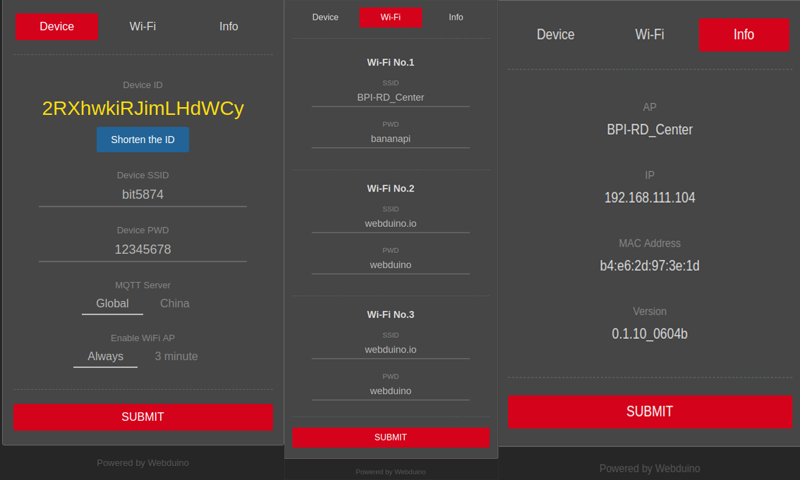
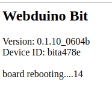
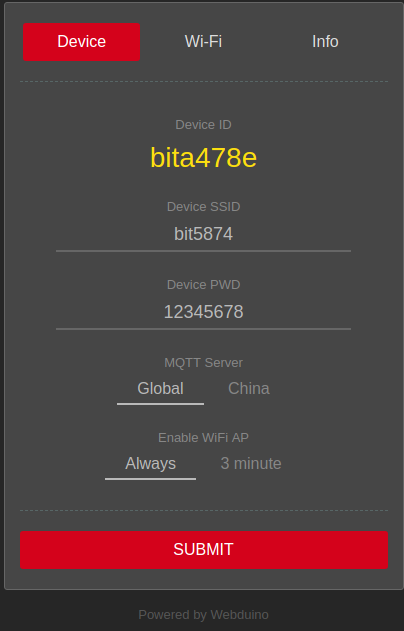

# Webduino Bit Initialization Settings

Before using the Webduino Bit, the most important thing is to initialize the settings. The purpose of the initialization settings is to allow the Webduino development board to automatically access the Internet (Internet), or to connect to the local area network via WebSocket. With the initial settings, we can also Customize the display name and password of the development board, and even connect to the internet for remote update.

## Webduino Bit Initialization Step Description

### 1. Connect the power supply and enter the WiFi account password to connect.

Connect the Webduino Bit to the power supply. At the beginning, the full color LED dot matrix on the front of the development board will display four numbers in sequence. These four numbers correspond to the SSID name in the WiFi search of the computer or mobile device (for example, display 1234, in The name of bit1234 will be seen in the WiFi search).

Because the development board has not been set up to connect to the local area network, the * will flash red at the beginning, then the red light will be steady*. Then prepare a WiFi-enabled computer, laptop, or mobile device to use the device to perform WiFi search for devices that have just seen "*bitXXXX*" (in the above example, search for bit1234).

Enter the default password **12345678** to go online.

### 2. Set WiFi account password and display name

* After confirming the successful connection*, open the browser (recommended to use Chrome), enter the address bar **192.168.4.1** Connect to the setting screen of the Bit development board, including the following settings:

- *WiFi SSID, PWD*: *Required* indicates which wireless network the development board should connect to.
- * Device ID *: the default blank, * will achieve the OTA update Device ID * (ID ** 18 yards default if, after OTA update shorter length replace ID **).
- * Device SSID, PWD *: WiFi device in the search display name and password, if not fill in automatically generated ID and (** before ** Do not modify remote OTA update yet) the default password 12345678.
- *MQTT Server*: The server to be connected to the development board, default *Global*, if you are in China, please select *China*.

After the setting is completed, press SUBMIT to save. The word “SAVE OK” indicates that the storage is successful. At this time, the Bit development board will restart and flash red. When the red light is off and the green light is on once, the Bit development board has been successfully linked. WiFi base station in the home or environment. (If the red light keeps flashing or steady light, please remove the power supply and restart steps 1 and 2)

**New interface introduction:**

The above figure shows that we have divided the new version of the interface into three parts. The first part is to set the basic information of the board, and at the same time, feedback the device ID of the bit board. The second part sets the WiFi that the board needs to connect. It can set three WiFi at the same time. Users can seamlessly switch between different scenes such as development environment and demonstration environment, eliminating the need to reset WiFi in another place. The third section shows the WiFi information and version information that the board is now connected to. At the same time, the Device ID in the above figure is still a long ID, but you can get the short ID by clicking the button below, but you need to keep the board in the network. After clicking on the `Shoren the ID`, you will see the following process information:

Get short ID results:

> Small reminder, version number Ver. 0.1_0_0719_01 and later, if the red light flashes, the "** blue light**" is illuminated instead of the green light, indicating that a new version is available for OTA update.

### 3. OTA Remote Update

OTA remote update can be obtained after the Webduino Bit is connected to the network, and the online server update obtains the latest firmware. The update steps are as follows:

> Attention! Do not remove the power of the development board during the update process to avoid the update failure.

- Step 1. Confirm that the development board can be connected to WiFi normally. If not, please check the WiFi connection or re-initialize the settings.
- Step 2. Remove the power from the development board.
- Step 3. Connect the power supply to the development board. **When the white light shows the number, press and hold the button A**.
- Step 4. **Press and hold button A. After the development board flashes red and the green light goes out, the buzzer will hear a slight sound and release the button A**. (If the OTA update is performed for the first time, the sound may appear after the button A is released)

- Step 5. After completion, you will see the dot matrix of the development board. **The first light starts to light blue**, indicating that the update is started. **When the blue light is all on and then off, the update is completed* *.

- Step 6. After the update is completed, the development board will flash red and automatically connect. When the connection is successful, the green light will be off and the green light will be off. When the OTA remote update is completed, you can see the white light that starts to display the number of the development board. "The way to become a "horselight" is presented. If you want to change the SSID display name of Device, you can use the WiFi online development board to modify it from 192.168.4.1, and at the bottom of the setting screen, you will also see The version number of the development board becomes 0528 or higher.

### 4. Open Webduino Blockly (Bit Experience Edition) for testing

To test the physical development board, you can open the sample program of Webudino Blockly (Bit Experience Edition) below, fill in the Device ID of the development board in the box space of the "Development Board", and then click the red execution button at the top right. The button will turn green, and you will also see the diamond development board lit up with red, green and blue diamonds.

If you don't have a physical development board, but want to experience the Webduino Bit, you can also open the sample program below. When you open it, you can see that there is an additional "emulator" area in the screen. This area contains a virtual Webduino Bit with Device ID. It is 1234, so as long as the development board's drop-down menu selects "Emulator", Device ID is entered as 1234. After execution, the virtual Bit development board will be seen, and the red, green and blue diamonds will be illuminated.

> Sample program: [https://goo.gl/PnK4FN](https://goo.gl/PnK4FN) & [Webduino Bit full color dot matrix display color] (https://webduino.com.cn/link. Html?lang=zh-hans&type=example&blockly=rgbmatrix01)

