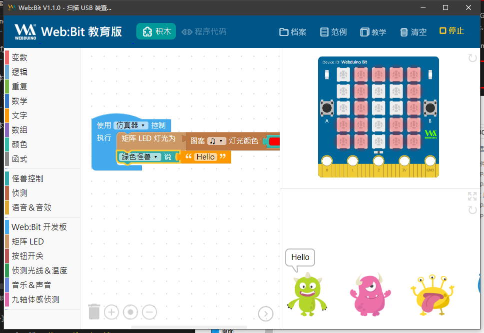
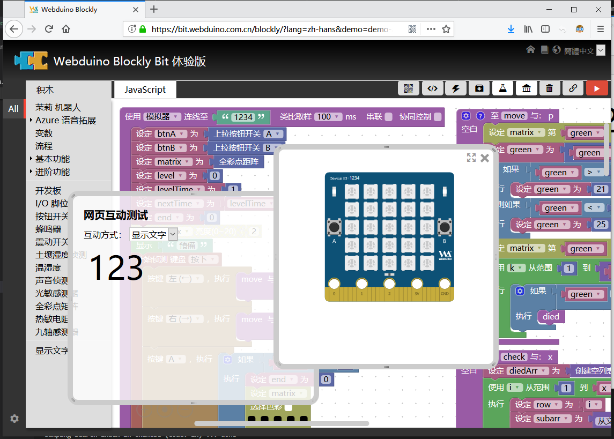

Release center
==============================================================

.. image:: logo.png

Webduino is a combination of Arduino X Web and developed using HTML \ JAVASCRIPT \ NODEJS (ES6).

It has a series of simple to specialized software systems, such as multi-language environment, direct blockly programming, building block plug-in interface, cloud server hosting, and IoT development examples.

Release firmware
------------------

From the official support firmware provided by Taiwan Webduino, it adds many additional features, such as IoT development, code hosting, building block programming and so on.

- `Using the tutorial <https://github.com/BPI-STEAM/BPI-BIT-WebDuino>`_
- `Project Homepage <https://github.com/webduinoio/wafirmata>`_

WebBit Education Edition
------------------------------------

- `Online documentation <https://tutorials.webduino.io/zh-tw/docs/webbit/index.html>`_ & `Online Website <https://webbit.webduino.io/blockly/>`_
- `Offline software <https://github.com/BPI-STEAM/BPI-BIT-WebDuino/releases>`_

Webduino development version
------------------------------------

.. Hint::

    The online tutorial has been synced to the advanced tutorial, please see the list on the left.

- `Online tutorial <https://webduino.com.cn/site/zh_cn/tutorials.html>`_ & `Online website <https://webduino.com.cn/site/en_us/index.html>`_

